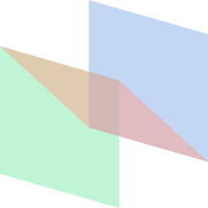

<!-- Improved compatibility of back to top link: See: https://github.com/othneildrew/Best-README-Template/pull/73 -->
<a name="readme-top"></a>
<!--
*** Thanks for checking out the Best-README-Template. If you have a suggestion
*** that would make this better, please fork the repo and create a pull request
*** or simply open an issue with the tag "enhancement".
*** Don't forget to give the project a star!
*** Thanks again! Now go create something AMAZING! :D
-->


<!-- PROJECT SHIELDS -->
<!--
*** I'm using markdown "reference style" links for readability.
*** Reference links are enclosed in brackets [ ] instead of parentheses ( ).
*** See the bottom of this document for the declaration of the reference variables
*** for contributors-url, forks-url, etc. This is an optional, concise syntax you may use.
*** https://www.markdownguide.org/basic-syntax/#reference-style-links
-->
[![Contributors][contributors-shield]][contributors-url]
[![Forks][forks-shield]][forks-url]
[![Stargazers][stars-shield]][stars-url]
[![Issues][issues-shield]][issues-url]
[![MIT License][license-shield]][license-url]


<!-- PROJECT LOGO -->
<br />
<div align="center">
  <a href="https://github.com/pnichols04/three-js-starter-template">
    
  </a>

<h3 align="center">Three.js Starter Template</h3>

  <p align="center">
    Get your Three.js projects up and running quickly with this modular, manageable template, based on Lewy Blue&rsquo;s <a href="https://discoverthreejs.com/book/"><i>Discover Three.js</i></a>.  I use this template as a common starting point for Three.js articles on <a href="https://pnichols04.github.io">my blog</a>.
    <br />
    <br />
    <a href="https://github.com/pnichols04/three-js-starter-template">View Demo</a>
    ·
    <a href="https://github.com/pnichols04/three-js-starter-template/issues">Report Bug</a>
    ·
    <a href="https://github.com/pnichols04/three-js-starter-template/issues">Request Feature</a>
  </p>
</div>

<!-- ABOUT THE PROJECT -->
## About The Project

For more information, see my blog post <a href="https://pnichols04.github.io/blog/a-three-js-starter-template/">A Three.js Starter Template</a>.  For general background, including a step-by-step walkthrough of building a similarly-structured application, see <i>Discover Threee.js</i>, starting from <a href="https://discoverthreejs.com/book/first-steps/world-app/">Chapter 1-3, "Introducing the World App."</a>

[![Product Name Screen Shot][product-screenshot]](https://example.com)

<p align="right">(<a href="#readme-top">back to top</a>)</p>


<!-- GETTING STARTED -->
## Getting Started

To get a local copy up and running follow these simple example steps.

### Prerequisites

To be able to run the project in a local server, you&rsquo;ll need to have <a href="https://nodejs.org/en/download/">Node.js and NPM</a> installed.

### Installation

1. Clone the repo
   ```sh
   git clone https://github.com/pnichols04/three-js-starter-template.git
   ```
3. Install NPM packages
   ```sh
   npm install
   ```

<p align="right">(<a href="#readme-top">back to top</a>)</p>


<!-- USAGE EXAMPLES -->
## Usage

Run the project in a local server
```sh
npm run serve
```

_For more examples, please refer to the [blog post](https://pnichols04.github.io/blog/a-three-js-starter-template/)_

<p align="right">(<a href="#readme-top">back to top</a>)</p>


<!-- CONTRIBUTING -->
## Contributing

Contributions are what make the open source community such an amazing place to learn, inspire, and create. Any contributions you make are **greatly appreciated**.

If you have a suggestion that would make this better, please fork the repo and create a pull request. You can also simply open an issue with the tag "enhancement".
Don't forget to give the project a star! Thanks again!

1. Fork the Project
2. Create your Feature Branch (`git checkout -b feature/AmazingFeature`)
3. Commit your Changes (`git commit -m 'Add some AmazingFeature'`)
4. Push to the Branch (`git push origin feature/AmazingFeature`)
5. Open a Pull Request

<p align="right">(<a href="#readme-top">back to top</a>)</p>


<!-- CONTACT -->
## Contact

Your Name - [@PhilipNichols04](https://twitter.com/PhilipNichols04) - philip.j.nichols@gmail.com

Project Link: [https://github.com/pnichols04/three-js-starter-template](https://github.com/pnichols04/three-js-starter-template)

<p align="right">(<a href="#readme-top">back to top</a>)</p>


<!-- ACKNOWLEDGMENTS -->
## Acknowledgments

* [Three.js](https://threejs.org)
* [_Discover Three.js_ by Lewy Blue](https://discoverthreejs.com/book/)

<p align="right">(<a href="#readme-top">back to top</a>)</p>

<!-- LICENSE -->
## License

Distributed under the MIT License. See `LICENSE.txt` for more information.

Not affiliated with or endorsed by Lewy Blue or _Discover Three.js_.

<p align="right">(<a href="#readme-top">back to top</a>)</p>


<!-- MARKDOWN LINKS & IMAGES -->
<!-- https://www.markdownguide.org/basic-syntax/#reference-style-links -->
[contributors-shield]: https://img.shields.io/github/contributors/pnichols04/three-js-starter-template.svg?style=for-the-badge
[contributors-url]: https://github.com/pnichols04/three-js-starter-template/graphs/contributors
[forks-shield]: https://img.shields.io/github/forks/pnichols04/three-js-starter-template.svg?style=for-the-badge
[forks-url]: https://github.com/pnichols04/three-js-starter-template/network/members
[stars-shield]: https://img.shields.io/github/stars/pnichols04/three-js-starter-template.svg?style=for-the-badge
[stars-url]: https://github.com/pnichols04/three-js-starter-template/stargazers
[issues-shield]: https://img.shields.io/github/issues/pnichols04/three-js-starter-template.svg?style=for-the-badge
[issues-url]: https://github.com/pnichols04/three-js-starter-template/issues
[license-shield]: https://img.shields.io/github/license/pnichols04/three-js-starter-template.svg?style=for-the-badge
[license-url]: https://github.com/pnichols04/three-js-starter-template/blob/master/LICENSE.txt
[linkedin-shield]: https://img.shields.io/badge/-LinkedIn-black.svg?style=for-the-badge&logo=linkedin&colorB=555
[linkedin-url]: https://linkedin.com/in/linkedin_username
[product-screenshot]: images/screenshot.png
[Next.js]: https://img.shields.io/badge/next.js-000000?style=for-the-badge&logo=nextdotjs&logoColor=white
[Next-url]: https://nextjs.org/
[React.js]: https://img.shields.io/badge/React-20232A?style=for-the-badge&logo=react&logoColor=61DAFB
[React-url]: https://reactjs.org/
[Vue.js]: https://img.shields.io/badge/Vue.js-35495E?style=for-the-badge&logo=vuedotjs&logoColor=4FC08D
[Vue-url]: https://vuejs.org/
[Angular.io]: https://img.shields.io/badge/Angular-DD0031?style=for-the-badge&logo=angular&logoColor=white
[Angular-url]: https://angular.io/
[Svelte.dev]: https://img.shields.io/badge/Svelte-4A4A55?style=for-the-badge&logo=svelte&logoColor=FF3E00
[Svelte-url]: https://svelte.dev/
[Laravel.com]: https://img.shields.io/badge/Laravel-FF2D20?style=for-the-badge&logo=laravel&logoColor=white
[Laravel-url]: https://laravel.com
[Bootstrap.com]: https://img.shields.io/badge/Bootstrap-563D7C?style=for-the-badge&logo=bootstrap&logoColor=white
[Bootstrap-url]: https://getbootstrap.com
[JQuery.com]: https://img.shields.io/badge/jQuery-0769AD?style=for-the-badge&logo=jquery&logoColor=white
[JQuery-url]: https://jquery.com 